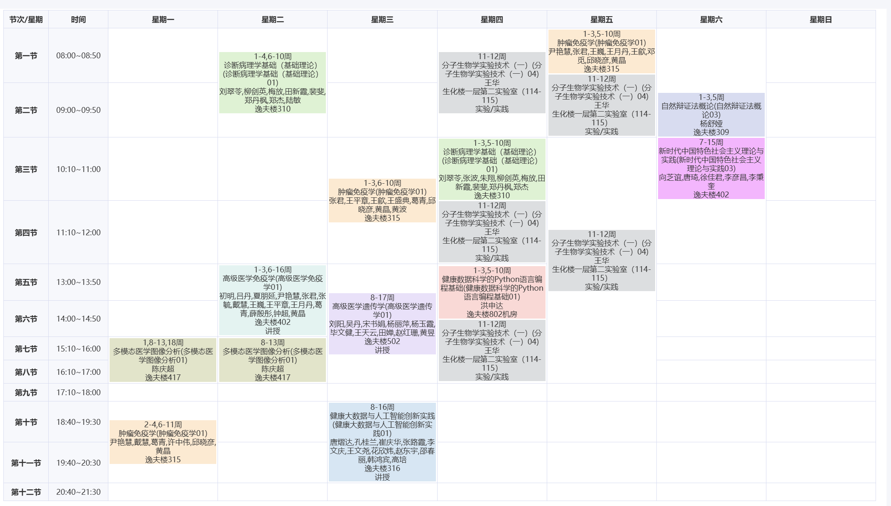

I am a research-oriented postgraduate student in Computational Pathology at the [Peking University Third Hospital](https://www.puh3.net.cn/). I am fortunate to be advised by Professor Zhou. My research interests lie in predicting cancer prognosis and metastasis from histopathological whole-slide images, with a particular focus on the alignment and fusion of multimodal data.

[Email](mailto:suchenghan25@stu.pku.edu.cn) / [Github](https://github.com/Do-1t-now) / [Wechat](../images/hello_guys.jpg) 

My first-year graduate courses
======

For more info
------
More info about configuring Academic Pages can be found in [the guide](https://academicpages.github.io/markdown/), the [growing wiki](https://github.com/academicpages/academicpages.github.io/wiki), and you can always [ask a question on GitHub](https://github.com/academicpages/academicpages.github.io/discussions). The [guides for the Minimal Mistakes theme](https://mmistakes.github.io/minimal-mistakes/docs/configuration/) (which this theme was forked from) might also be helpful.
